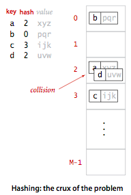
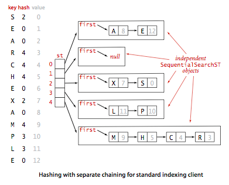

#Data Structures

- Hash Tables
- ArrayList
- StringBuffer/StringBuilder

##Hash Table ([source](http://http://algs4.cs.princeton.edu/34hash/))

- - **Goal:** Create an array type structure that can hold M key-value pairs
- Quick description
	- A hash table allows us to access values via keys
	- Each key maps to a bucket of value(s).
	- Keys can be any arbitrary type
	
- How? It's a two step process
	- Hash Function
	- Collision-resolution
	

###Step 1 - Hash Function

- First keys are passed to the hashing function
- This converts the key to an index value in the table
- Hashing function not perfect
- Some keys may result in same table index(or bucket)
- **Goal** of the function is to evenly distribute M key-value pairs

There are a few types of data types we can hash for.

- Positive Integers
- Floating-point numbers
- Strings
- Compound keys
- Java Conventions
- hashCode

Requirements for a hash table

- Deterministic - equal keys must produce same hash value
- Efficient to compute
- Uniformly distribute keys

###Step 2 - Collision Resolution

What happens if two key value pairs end up with same table index?

- You can use different techniques to deal with this issue
	- Linear Probing
	- Chaining via Linked List
	
####Linked List approach

In this approach, when a collision occurs, you create a linked list at that table index, and append the key value pair to the end of the linked list at that table index

####Linear probing approach

There's two things you could be doing:

- Searching
- Inserting

When you hit a table index with an existing key value pair, you simply look to the next table index for an empty bucket

