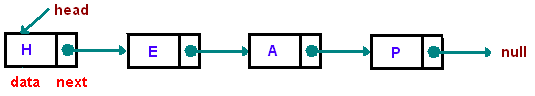
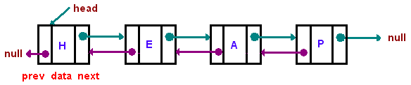

#Linked Lists

[source](https://www.cs.cmu.edu/~adamchik/15-121/lectures/Linked%20Lists/linked%20lists.html)

##Intro

Linked lists are datastructures that contain a data item as well as a pointer to the next item in the list. This data item and pointer combination is referred to as a Node.

###Useful facts
- **Head:** Entry point of linked list 
- **Tail:** Last node of linked list (has next pointing to *null*)
- It's a dynamic data structure, not fixed size

###Types of Linked Lists

- Singly linked (figure above)
- Doubly linked - contain links to *previous* and *next* nodes

###The classes

As mentioned before linked lists contain nodes

- Python

		class Node:
			def __init__(self, data=None, next=None):
				self.data = data
				self.next = next
- C++

		template
		class Node<T>{
		private:
			T data;
			Node<T> *next;
		
		public:
			Node<T>(T dat){ data = dat; }
			Node<T>(T dat, Node<T> *node){
				data = dat;
				next = node;
			}
			~Node<T>(){ next = NULL; }
			Node<T> *getNext(){ return next; }
			T getData(){ return data; }
			void setNext(Node<T>* _next){ next = _next; } 
		};
		
The code above is the base for creating a linked list node. There are other methods that we can define for doing operations on the list.

- addFirst/prepend
- traverse
- addLast/append
- insertAfter
- insertBefore
- Delete
- shallow/deep copying

##Applications

What's the point in linked lists?

- Polynomial Algebra
- Can be used to implement stacks, queues
- Can be used for chaining in hash tables
- Operating systems use them for process queues, waiting queues
- Sparse matrices
- more,

##Interview Intuition/Problems

- Remove duplicates from unsorted list
	- Can do it in O(n) time with a buffer
	- without a buffer, you compare each node at index i to all nodes at index i+1 to the length of the list 
- Return Nth to last element
	- where 1st to last element in a list like [a -> b -> c -> d] would be 'd' 
	- method 1
		- calculate length of list in O(n) time
		- start at beginning of list again
		- move until length - index == n, where n is the Nth number your interested in
		- and index is a zero based index of node position in the list 
	- method 2
		- you can also do this recursively
		- recursively go to end of list
		- when you reach the end/bottom
		- then start incrementing a counter
		- when the counter equals n, return that node your looking at
- Delete a node (middle of list) given a reference to that node
	- Import note, this can't work for the end of the list
		- try it out on paper and you'll see
	- Two ways to do it
	- Simple way (will lead to memory leak in C++)
		- just copy the data from the next node into the current one
		- then set the current node next to the next node's next 
	- More complicated (no leak)
		- Copy the data from next node into current one
		- if the current nodes "next next" node is null
			- delete the current->next node
			- set current->next to null
		- move to next node
		
- Find a loop within a linked list (see 2-5.cpp)
	- with a buffer you store duplicate addresses, and simply return the address with a duplicate
	- without a buffer, you can use two pointers. First move them at different speeds to find an intersection.. Then move them at the same speed to find the actual loop start

