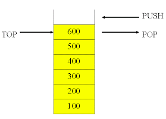

#Stacks and Queues

[Source](http://www.sourcetricks.com/2008/07/c-stacks.html#.WBKb_2V2AX8)

[Source 2](http://introcs.cs.princeton.edu/java/43stack/)

##Stack

Stacks are a first in last out (FILO) data structure. **Note:** last in first out (LIFO) is the same thing.

Typical use cases of a stack:

- Function call stacks from debuggers
- call and return process
- memory managment
- backtracking

- It's restricted data structure since it only has a few methods
	- push - add element to top stack
	- pop - remove element from top of stack
	- top/peek - view the element at the top of the stack
	

##Queue

Queues are a first in first out (FIFO) data structure.

Some example applications for a queue:

- M/M/1 queue
- Load balancing
	- Add tasks/jobs to global queue(s)
	- Allow workers to process jobs in the order they arrive to the queue