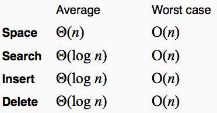
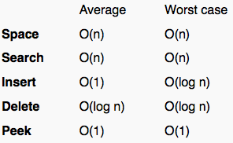

#Trees and Graphs

##Trees

- Trees are hierarchal data structures
- Every tree has a node called the root
- Each node can have 1 or more nodes as children
- A node that has no children is a leaf

Applications of trees include data compression, file storage, game trees

###Common types of trees

- Binary Tree - trees where nodes have at most two children
- Binary Search Tree 
	- Trees where nodes have at most two children
	- Children to left of any node in tree are less than or equal to that node
	- Children to right greater than
- Max Heap
	- Type of tree where the root is always the max value
	- All children beneath a node are smaller than  that node
	- "Almost Balanced"/"Complete" every level besides the bottom level has max amount of nodes
	- Thus, all nodes must have two children except for the last level
	- Extra nodes in bottom level are stored from left most node
- Min Heap
	- Same as max heap, except the root is the minimum value
	- And, all children below node are greater than the node

###Complexity
- Trees are good for efficient searching and sorting
- Here are the time and space complexities for a few special trees

####Binary Search Trees

- The logarithmic search, insert, delete complexities come from the fact that each decision for traversing the tree effectively removes half of the tree

####Binary Heap

- Binary heap, aka a max/min heap, allows for fast access of max/min values out of a larger set of values
- 
