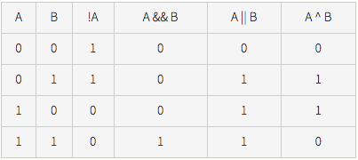

#Chapter 5 - Bit Manipulation

##Intro

- Source [https://www.topcoder.com/community/data-science/data-science-tutorials/a-bit-of-fun-fun-with-bits/](https://www.topcoder.com/community/data-science/data-science-tutorials/a-bit-of-fun-fun-with-bits/)

- Bit manipulation can be a good optimization in problems/algorithms
- Bit manipulation is centered around bit-wise operators 
	- & (and)
	- | (or)
	- ~ (not)
	- ^ (xor)

- Here are truth tables for boolean operators

- Bit-wise versions are the same
	- A & B = 1000
	- A | B = 1110
	- A ^ B = 0110
	- ~A = 11110101 (number of 1's depends on type of A)
- Two other operators are **shift** operators
	- `a << b` : left shift is essentially multiplication by 2^b
	- `a >> b` : right shift is a division by 2^b
- right most bit is least significant bit
- `1 << x` is number with the x'th bit set

##Some useful operations

- Set union: `A | B`
- Set intersection: `A & B`
- Set subtraction: `A & ~B`
- Set negation: `ALL_BITS ^ A`
- Set bit x: `A |= 1 << x`
- Clear bit x: `A &= ~(1 << x)`

##Addition via carrying

- Rules

		0 + 0 = 0
		0 + 1 = 1
		1 + 0 = 1
		1 + 1 = 0, and carry 1 to next more sig bit
		
- Example 1: `11 + 1`

		  1011
		+ 0001	
		------
		  1100
		  
- Example 2: `20 + 5`

		  11000
		+ 00101
		-------
		  11101  

##Subtracting via Borrow Method

- Rules

		0 - 0 = 0
		0 - 1 = 1, and borrow from next more sig bit
		1 - 0 = 1
		1 - 1 = 0

- While looking at a column, can't do `0 - 1` in binary simply
- Need to borrow `1` from more significant bit (aka to the left)
- Keep going left until you see a 1
- Once you get back to the column you started from, make that a `10 - 1` ("two minus 1")
- All columns before, just put a `1` there, and subtract normally

- Example 1: in decimal, `8 - 3`

		  1000
		- 0101
		------
		  0011 
		  
- Example 2: in decimal `16 - 6`

		  10000
		- 00110
		-------
		  01010
		  
- Example 3: in decimal `24 - 7`

		  11000
		- 00111
		-------
		  10001
		  
##Multiplication

- Rules

		0 x 0 = 0
		0 x 1 = 0
		1 x 1 = 1, no carry or borrow
		1 x 0 = 0 
		
- For large numbers with multiple bits set, multiply the top number by each bit/column in the bottom number. see examples below
		
- Example 1: `8 x 3`

		  1000
		x 0011
		------
		  1000
		 1000
		------
		 11000
- Example 2: `21 x 4`

				  10101
				x 00100
				-------
				  00000
				 00000
				10101
				-------
				1010100

##Division
- It's the repeated process of subtraction
- Divide larger number by smaller number
- While dividing, just subtract (using borrow rule as described earlier)

- Example 1: `6 / 3`

		     0010 (answer, decimal 2)
		     ----
		11 / 0110
		   - 0
		   ---
		     01
		   - 00
		   ----
		      11
		    - 11
		    ----
		      000
		      
- Example 2: `85 / 5`

		85 = 1010101
		5  = 0000101
		
			  0010001
			  ---------
		101 / 1010101
		    - 0
		    ---
		      10
		    - 00
		    ----
		      101
		    - 101
		    -----
		        00
		      - 00
		      ----
		        001
		      - 000
		      -----
		          10
		        - 00
		        ----
		          101
		        - 101
		        -----
		          000
		          

		          
		        
		        
		        
		      

		

		
		
				